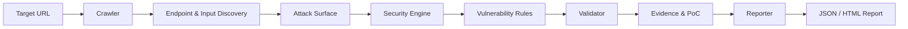

# SUDARSHAN v3

### Dynamic Application Security Testing Engine

### Author: Nilanjan Chowdhury (@CalculusGuy)

**SUDARSHAN** is a Python-based DAST engine designed to discover, detect, validate, and report web application vulnerabilities.

> **Scan → Detect → Validate → Prove → Report**

---

## Features

* Automated web application crawling
* Modular vulnerability detection rules
* Concurrent security testing
* Dedicated finding validation
* Evidence and PoC generation
* JSON reporting
* HTML reporting
* Baseline/control/attack validation
* Automated tests
* CLI and API support

---

## Workflow



### Pipeline

```text
Target
  ↓
Crawler
  ↓
Discovery
  ↓
Attack Surface Mapping
  ↓
Detection Engine
  ↓
Validation
  ↓
Evidence / PoC
  ↓
Report
```

---

## Architecture

```text
SUDARSHAN
│
├── crawler/          → Web crawling & discovery
├── engine/           → Detection engine
├── rules/            → Vulnerability rules
├── validator/        → Finding validation
│   └── checks/       → SQLi, XSS, SSRF, SSTI, IDOR, CMDi
├── reporter/         → Reports & PoCs
├── utils/            → Supporting analysis
├── tests/            → Automated tests
│
├── main.py           → CLI entry point
├── app.py            → API / application interface
└── index.html        → Web interface
```

---

## Supported Vulnerability Classes

SUDARSHAN currently includes rules for:

* SQL Injection
* Cross-Site Scripting (XSS)
* SSRF
* Path Traversal
* Command Injection
* XXE
* CSRF
* JWT Weaknesses
* Open Redirect
* IDOR
* LDAP Injection
* XPath Injection
* Host Header Injection
* NoSQL Injection
* Unrestricted File Upload
* SSTI
* HTTP Request Smuggling
* CORS Misconfiguration
* Race Conditions
* GraphQL Injection
* Log4Shell
* Sensitive Data Exposure

---

## Requirements

* Python 3.8+
* pip
* Git

---

## Installation

```bash
git clone https://github.com/CalculusGuy/SUDARSHAN.git
cd SUDARSHAN

python3 -m venv venv
source venv/bin/activate

pip install -r requirements.txt
```

Check the CLI:

```bash
python main.py --help
```

---

## Usage

### Basic Scan

```bash
python main.py --target https://example.com
```

### Full Scan

```bash
python main.py \
    --target https://example.com \
    --threads 20 \
    --report both \
    --poc \
    --max-pages 50
```

### Useful Options

| Option         | Description              |
| -------------- | ------------------------ |
| `--target`     | Target URL               |
| `--threads`    | Concurrent workers       |
| `--report`     | JSON / HTML / both       |
| `--report-dir` | Report output directory  |
| `--max-pages`  | Maximum pages to crawl   |
| `--poc`        | Generate PoCs            |
| `--poc-dir`    | PoC output directory     |
| `--insecure`   | Disable TLS verification |
| `--timeout`    | Request timeout          |
| `--help`       | Show help                |

---

## Project Structure

```text
SUDARSHAN/
├── .github/workflows/
├── crawler/
│   └── crawler.py
├── engine/
│   └── engine.py
├── reporter/
│   ├── poc_generator.py
│   └── reporter.py
├── rules/
│   └── dast_rules.json
├── validator/
│   ├── checks/
│   │   ├── cmdi.py
│   │   ├── idor.py
│   │   ├── sqli.py
│   │   ├── ssrf.py
│   │   ├── ssti.py
│   │   └── xss.py
│   ├── http_client.py
│   ├── result.py
│   └── validator.py
├── utils/
│   └── diff_analyzer.py
├── tests/
│   ├── conftest.py
│   └── test_scanner.py
├── main.py
├── app.py
├── index.html
├── requirements.txt
├── render.yaml
└── Procfile
```

---

## Validation

SUDARSHAN separates **detection** from **validation**.

```text
Detection
    ↓
Potential Finding
    ↓
Validator
    ↓
Control / Baseline Comparison
    ↓
Confirmed Finding
    ↓
Evidence
    ↓
PoC / Report
```

Dedicated validators currently include:

```text
SQLi
XSS
SSRF
SSTI
IDOR
Command Injection
```

---

## Reports

SUDARSHAN can generate:

* JSON reports
* HTML reports
* Finding evidence
* Proof-of-concept outputs

Example output:

```text
reports/
├── report.json
└── report.html

pocs/
└── vulnerability-specific PoCs
```

---

## Testing

Run the test suite with:

```bash
pytest
```

---

## Responsible Use

SUDARSHAN is intended for **authorized security testing only**.

Only scan applications that you own or have explicit permission to test.

Do not use the tool to:

* Access unauthorized systems
* Steal or modify data
* Disrupt production services
* Bypass security controls without authorization
* Perform destructive testing without approval

---

## Project

**Author:** Nilanjan Chowdhury

**Repository:**
https://github.com/CalculusGuy/SUDARSHAN

**Live Demo:**
https://sudarshan-api-z66i.onrender.com/

**Portfolio:**
https://calculusguy.github.io/nilanjanchowdhury.github.io/

---

## License

MIT License
