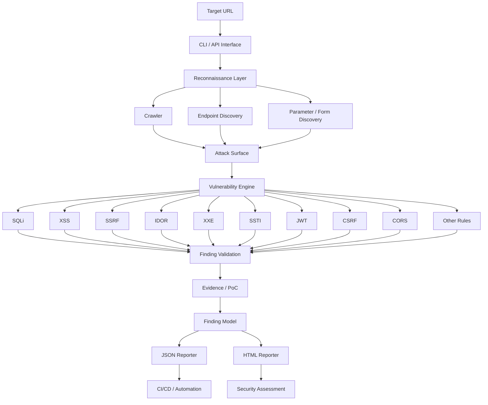
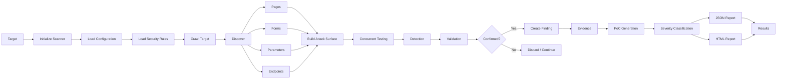
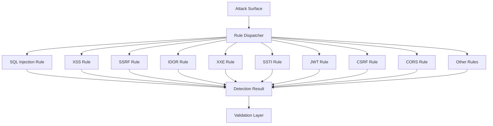
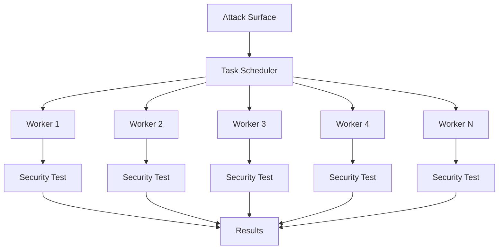
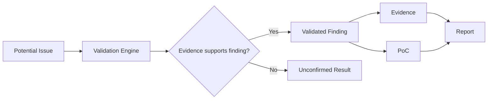
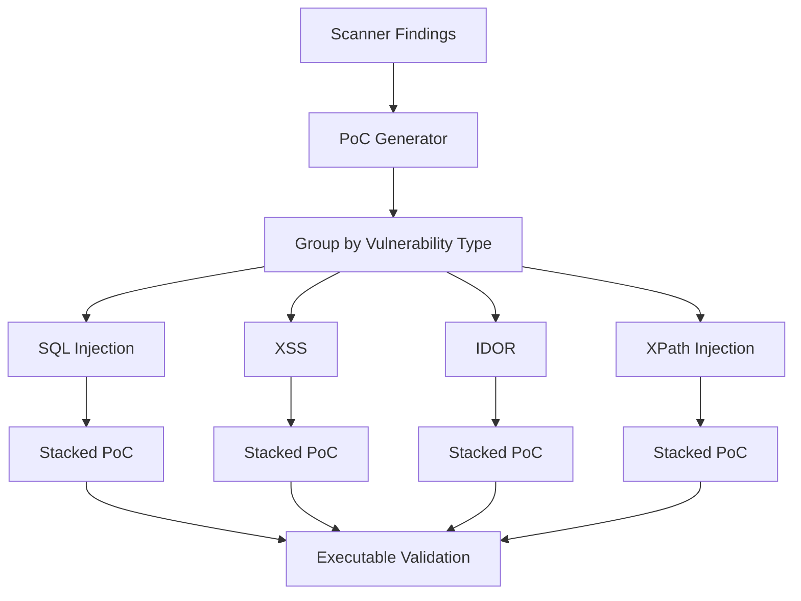
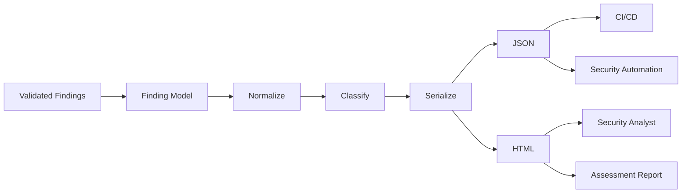
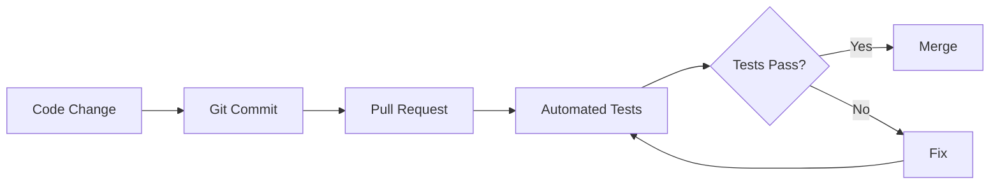
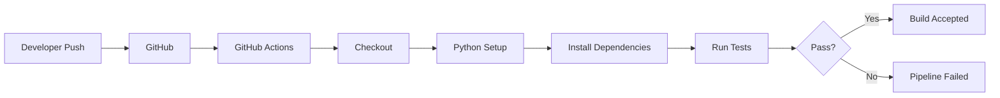
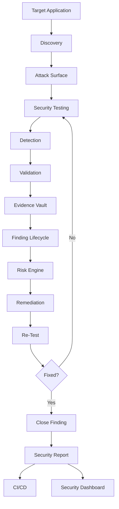

# ⚔️ SUDARSHAN

### Enterprise-Grade Dynamic Application Security Testing Engine

<p align="center">
  <b>Scan. Detect. Validate. Prove. Report. Secure.</b>
</p>

<p align="center">
  <a href="https://github.com/CalculusGuy/SUDARSHAN">
    
  </a>
  
  
  
  
  
</p>

<p align="center">
  <i>A Python-based DAST engine for automated web application security assessment, vulnerability discovery, validation, PoC generation, and structured security reporting.</i>
</p>

---

## 🐉 What is SUDARSHAN?

**SUDARSHAN** is a modular, Python-based **Dynamic Application Security Testing (DAST)** engine designed to automate security testing of web applications.

Instead of treating a scanner as a simple collection of payloads, SUDARSHAN is structured as a security assessment pipeline:

```text
Target
   │
   ▼
Reconnaissance
   │
   ▼
Endpoint & Input Discovery
   │
   ▼
Attack Surface Mapping
   │
   ▼
Vulnerability Detection
   │
   ▼
Finding Validation
   │
   ▼
Evidence / PoC Generation
   │
   ▼
Risk Classification
   │
   ▼
JSON + HTML Reporting
```

The project focuses on building the engineering foundations behind an extensible security scanner:

* Modular vulnerability rules
* Concurrent security testing
* Structured findings
* Automated validation
* Proof-of-concept generation
* Evidence collection
* Machine-readable reporting
* Human-readable reporting
* Automated testing
* CI/CD integration

---

# 🎯 Why SUDARSHAN?

Traditional security testing often involves repeatedly performing the same workflow:

```text
Discover → Test → Verify → Document → Report → Retest
```

SUDARSHAN aims to automate the repetitive portions of this lifecycle while keeping the results structured enough for further analysis.

### Core philosophy

> **Don't just detect a vulnerability. Produce enough structured information to understand, reproduce, validate, and report it.**

---

# 🚀 Key Capabilities

| Capability                         | Status |
| ---------------------------------- | ------ |
| 🔍 Web crawling & discovery        | ✅      |
| 🧪 Rule-based vulnerability engine | ✅      |
| ⚡ Concurrent scanning              | ✅      |
| 📊 JSON reporting                  | ✅      |
| 🌐 HTML reporting                  | ✅      |
| 🧾 Structured findings             | ✅      |
| 🧪 Automated testing               | ✅      |
| 🔄 GitHub Actions CI/CD            | ✅      |
| 🧰 CLI interface                   | ✅      |
| 🧬 PoC generation                  | ✅      |
| 📝 Centralized logging             | ✅      |
| 🔐 Authentication-aware scanning   | 🚧     |
| 📡 API security testing            | 🚧     |
| 📈 CVSS-based scoring              | 🚧     |
| ♻️ Finding deduplication           | 🚧     |
| 🔁 Evidence replay                 | 🚧     |
| 📚 Scan history                    | 🚧     |
| 📄 SARIF output                    | 🚧     |

---

# 🧠 Vulnerability Coverage

SUDARSHAN currently implements **22 vulnerability/security detection classes**.

|  # | Vulnerability                           |   Severity  |
| -: | --------------------------------------- | :---------: |
| 01 | SQL Injection                           | 🔴 Critical |
| 02 | Cross-Site Scripting (XSS)              |   🟠 High   |
| 03 | Server-Side Request Forgery (SSRF)      |   🟠 High   |
| 04 | Path Traversal                          |   🟠 High   |
| 05 | Command Injection                       | 🔴 Critical |
| 06 | XML External Entity (XXE)               | 🔴 Critical |
| 07 | Cross-Site Request Forgery (CSRF)       |   🟠 High   |
| 08 | JWT Weakness                            |   🟠 High   |
| 09 | Open Redirect                           |  🟡 Medium  |
| 10 | Insecure Direct Object Reference (IDOR) |   🟠 High   |
| 11 | LDAP Injection                          | 🔴 Critical |
| 12 | XPath Injection                         |   🟠 High   |
| 13 | Host Header Injection                   |  🟡 Medium  |
| 14 | NoSQL Injection                         | 🔴 Critical |
| 15 | Unrestricted File Upload                |   🟠 High   |
| 16 | Server-Side Template Injection (SSTI)   | 🔴 Critical |
| 17 | HTTP Request Smuggling                  |   🟠 High   |
| 18 | CORS Misconfiguration                   |  🟡 Medium  |
| 19 | Race Condition                          |   🟠 High   |
| 20 | GraphQL Injection                       | 🔴 Critical |
| 21 | Log4Shell — CVE-2021-44228              | 🔴 Critical |
| 22 | Sensitive Data Exposure                 |  🟡 Medium  |

> **Note:** Severity represents the scanner's classification and should not be treated as a final risk rating without application-specific context and manual validation.

---

# 🏗️ System Architecture



---

# 🔄 Complete Scan Workflow

The complete SUDARSHAN workflow can be represented as:



---

# 🔍 1. Reconnaissance & Discovery

The scanner begins by mapping the target's accessible attack surface.

```text
                    TARGET
                      │
                      ▼
               ┌─────────────┐
               │   Crawler   │
               └──────┬──────┘
                      │
        ┌─────────────┼─────────────┐
        ▼             ▼             ▼
     Pages          Forms       Endpoints
        │             │             │
        └─────────────┼─────────────┘
                      ▼
              Parameters / Inputs
                      │
                      ▼
                Attack Surface
```

The discovery stage provides the vulnerability engine with structured targets instead of blindly firing payloads at arbitrary URLs.

---

# ⚔️ 2. Vulnerability Detection Engine

SUDARSHAN uses a modular rule-based architecture.



Each security rule is designed to operate independently, allowing new vulnerability classes to be added without redesigning the entire scanner.

---

# ⚡ 3. Concurrent Scanning

SUDARSHAN uses Python's `ThreadPoolExecutor` to execute independent security checks concurrently.



### Example

```bash
python main.py \
    --target https://example.com \
    --threads 20
```

Concurrency is configurable from the command line.

---

# 🧪 4. Finding Validation

Detection alone can produce noisy results.

SUDARSHAN therefore separates:

```text
Detection
    ↓
Validation
    ↓
Finding
```

Conceptually:



This architecture provides a foundation for future improvements such as confidence scoring, response-diff analysis, replayable evidence, and finding deduplication.

---

# 🧬 5. Stacked PoC Generation

One of SUDARSHAN's distinctive features is **stacked PoC generation**.

Instead of generating an isolated script for every single request, findings can be grouped by vulnerability type.

Example:

```text
pocs/
├── poc_DAST-001.py
├── poc_DAST-002.py
├── poc_DAST-010.py
└── poc_DAST-012.py
```

Conceptually:



A generated PoC can:

* Iterate through related findings
* Test each finding
* Track successful confirmations
* Produce a summary
* Execute checks concurrently where appropriate

This creates a bridge between:

```text
Scanner Output
      ↓
Security Finding
      ↓
Reproducible Validation
```

---

# 📊 6. Reporting Pipeline

SUDARSHAN converts scan results into structured security reports.



### JSON

Designed for:

* CI/CD
* Security automation
* Dashboards
* Data processing
* Tool integration

Example:

```json
{
  "target": "https://example.com",
  "findings": [
    {
      "vulnerability": "Cross-Site Scripting",
      "severity": "High",
      "endpoint": "/search",
      "parameter": "q"
    }
  ]
}
```

### HTML

Designed for human review.

Reports include information such as:

* Target
* Vulnerability type
* Severity
* Endpoint
* Parameter
* Evidence
* Scan information
* Finding details

---

# 🔬 Test Results

SUDARSHAN has been exercised against intentionally vulnerable and security-testing targets.

| Target              | Reported Findings | PoC Generation |
| ------------------- | ----------------: | :------------: |
| `demo.testfire.net` |               334 |        ✅       |
| `hackthissite.org`  |              136+ |        ✅       |

### Example scan

```bash
python main.py \
    --target https://demo.testfire.net/ \
    --poc \
    --insecure \
    --threads 15 \
    --max-pages 20
```

Example output:

```text
[+] Found 20 pages, 22 forms
[INFO] Loaded 22 rules
[+] Scan complete! Found 334 vulnerabilities.
[+] PoC scripts generated

  - IDOR
  - XPath Injection
  - NoSQL Injection
  - Sensitive Data Exposure
```

> **Important:** Scanner-reported findings should be manually validated before being treated as confirmed vulnerabilities. Automated scanners can produce false positives depending on application behavior.

---

# 🧰 CLI

### Basic scan

```bash
python main.py --target https://example.com
```

### Concurrent scan

```bash
python main.py \
    --target https://example.com \
    --threads 20
```

### Generate PoCs

```bash
python main.py \
    --target https://example.com \
    --poc
```

### Generate both reports

```bash
python main.py \
    --target https://example.com \
    --report both
```

### Full example

```bash
python main.py \
    --target https://example.com \
    --threads 20 \
    --report both \
    --poc \
    --insecure \
    --max-pages 50
```

---

# ⚙️ CLI Configuration

| Option              | Description               | Default   |
| ------------------- | ------------------------- | --------- |
| `--target`, `-t`    | Target URL                | Required  |
| `--threads`, `-th`  | Concurrent workers        | `10`      |
| `--report`, `-r`    | `json`, `html`, or `both` | —         |
| `--report-dir`      | Report output directory   | `reports` |
| `--max-pages`, `-m` | Maximum pages to crawl    | `10`      |
| `--poc`, `-p`       | Generate PoCs             | Disabled  |
| `--poc-dir`         | PoC output directory      | `pocs`    |
| `--insecure`, `-k`  | Disable TLS verification  | Disabled  |
| `--timeout`         | Request timeout           | `10s`     |

---

# 🧪 Testing

SUDARSHAN includes automated tests to help prevent regressions as the scanner evolves.

Run:

```bash
pytest
```

Verbose mode:

```bash
pytest -v
```

Testing workflow:



---

# 🔄 CI/CD

SUDARSHAN includes GitHub Actions integration.



Example workflow:

```yaml
name: CI/CD Pipeline

on:
  push:
    branches: [main]
  pull_request:
    branches: [main]

jobs:
  test:
    runs-on: ubuntu-latest

    steps:
      - uses: actions/checkout@v3

      - name: Set up Python
        uses: actions/setup-python@v4
        with:
          python-version: "3.x"

      - name: Install dependencies
        run: pip install -r requirements.txt

      - name: Run tests
        run: pytest
```

---

# 📁 Project Structure

```text
SUDARSHAN/
│
├── main.py
├── app.py
├── index.html
│
├── requirements.txt
├── LICENSE
├── README.md
├── Procfile
├── render.yaml
│
├── crawler/
│   └── crawler.py
│
├── engine/
│   └── engine.py
│
├── rules/
│   └── dast_rules.json
│
├── reporter/
│   ├── reporter.py
│   └── poc_generator.py
│
├── tests/
│   └── test_scanner.py
│
├── reports/
│
└── pocs/
```

### Architecture by responsibility

```text
┌────────────────────────────────────────────┐
│                  SUDARSHAN                 │
├────────────────────────────────────────────┤
│                                            │
│  Interface                                │
│  ├── CLI                                  │
│  └── API                                  │
│                                            │
│  Discovery                                │
│  └── Crawler                              │
│                                            │
│  Detection                                │
│  ├── Rule Engine                          │
│  └── Security Rules                       │
│                                            │
│  Validation                               │
│  └── Finding Validation                   │
│                                            │
│  Evidence                                 │
│  └── PoC Generator                        │
│                                            │
│  Reporting                                │
│  ├── JSON                                 │
│  └── HTML                                 │
│                                            │
│  Quality                                  │
│  ├── pytest                               │
│  └── GitHub Actions                       │
│                                            │
└────────────────────────────────────────────┘
```

---

# 🛠️ Technology Stack

| Layer              | Technology           |
| ------------------ | -------------------- |
| Language           | Python               |
| HTTP / Web Testing | Python HTTP tooling  |
| Concurrency        | `ThreadPoolExecutor` |
| Testing            | pytest               |
| CI/CD              | GitHub Actions       |
| Reporting          | JSON + HTML          |
| Interface          | CLI + API wrapper    |
| Deployment         | Render configuration |
| License            | MIT                  |

---

# 🧱 Design Principles

SUDARSHAN is built around several engineering principles.

### 1. Modular

Security rules are isolated so new detection capabilities can be added without rewriting the scanner.

### 2. Extensible

The architecture allows future components such as:

```text
API Testing
Authentication
Session Handling
GraphQL
WebSockets
CVSS
SARIF
Evidence Replay
Scan History
```

### 3. Concurrent

Independent security checks can execute in parallel to reduce scan time.

### 4. Structured

Findings are represented as structured security data rather than plain console output.

### 5. Automation-Friendly

JSON output and CLI execution make the scanner suitable for security automation and CI/CD workflows.

### 6. Validation-Oriented

The long-term direction of the project is to move beyond:

```text
"Potential vulnerability detected"
```

toward:

```text
"Vulnerability detected
        ↓
Evidence collected
        ↓
PoC generated
        ↓
Finding tracked
        ↓
Remediation verified"
```

---

# 🧭 Roadmap

## Phase 1 — Core DAST

* [x] 22 vulnerability classes
* [x] Modular rule engine
* [x] Web crawling
* [x] Concurrent scanning
* [x] Structured findings
* [x] JSON reporting
* [x] HTML reporting
* [x] PoC generation
* [x] Centralized logging
* [x] Automated testing
* [x] GitHub Actions

## Phase 2 — Advanced Application Security

* [ ] Authentication-aware scanning
* [ ] Session management
* [ ] Cookie security analysis
* [ ] API discovery
* [ ] REST API testing
* [ ] GraphQL security testing
* [ ] Advanced endpoint discovery
* [ ] Finding deduplication
* [ ] Request/response comparison

## Phase 3 — Evidence & Validation

* [ ] Evidence vault
* [ ] Replayable requests
* [ ] Finding lifecycle
* [ ] Confidence scoring
* [ ] CVSS-based risk scoring
* [ ] Remediation tracking
* [ ] Automated re-testing

## Phase 4 — DevSecOps

* [ ] SARIF output
* [ ] GitHub Security integration
* [ ] Docker deployment
* [ ] Scheduled scans
* [ ] Scan history
* [ ] Security gates
* [ ] Pipeline failure thresholds

---

# 🔮 Future Architecture

The long-term direction is to evolve SUDARSHAN from a scanner into a complete application security assessment platform.



This architecture moves the project toward a continuous security validation model:

```text
Discover
   ↓
Attack
   ↓
Detect
   ↓
Prove
   ↓
Track
   ↓
Remediate
   ↓
Retest
   ↓
Close
```

---

# 📈 Why This Project Matters

SUDARSHAN demonstrates practical experience across multiple areas of application security engineering:

### Application Security

* Web attack surface discovery
* Vulnerability detection
* Security testing
* Finding validation
* Security evidence

### Security Engineering

* Modular architecture
* Concurrent execution
* Structured data models
* CLI engineering
* Automation

### DevSecOps

* Automated testing
* CI/CD integration
* Machine-readable reporting
* Security pipeline integration

### Software Engineering

* Python
* Modular components
* Automated tests
* Logging
* Configuration
* Extensible architecture

---

# 👨‍💻 Skills Demonstrated

```text
Application Security
        │
        ├── DAST
        ├── Web Security
        ├── Vulnerability Research
        ├── Security Testing
        └── PoC Development

Python Engineering
        │
        ├── Concurrency
        ├── CLI Development
        ├── Modular Architecture
        ├── Testing
        └── Automation

DevSecOps
        │
        ├── GitHub Actions
        ├── CI/CD
        ├── JSON Reporting
        └── Security Automation
```

---

# 🎯 Use Cases

SUDARSHAN is intended for:

* Authorized web application security assessments
* Security research
* DAST experimentation
* Vulnerability research
* Security engineering projects
* DevSecOps pipelines
* CI/CD security testing
* Controlled security labs
* Automated security regression testing

---

# ⚠️ Responsible Use

SUDARSHAN is a security testing tool.

**Only use it against systems you own or systems for which you have explicit authorization to perform security testing.**

Do not use SUDARSHAN to:

* Scan systems without authorization
* Disrupt production services
* Access unauthorized data
* Circumvent security controls
* Perform destructive testing without approval

The author is not responsible for misuse, unauthorized testing, service disruption, data loss, or damage resulting from the use of this software.

---

# ⚡ Quick Start

## 1. Clone

```bash
git clone https://github.com/CalculusGuy/SUDARSHAN.git
cd SUDARSHAN/DAST_Engine
```

## 2. Install

```bash
pip install -r requirements.txt
```

## 3. Run

```bash
python main.py --target https://example.com
```

## 4. Scan with concurrency

```bash
python main.py \
    --target https://example.com \
    --threads 20
```

## 5. Generate reports

```bash
python main.py \
    --target https://example.com \
    --report both
```

## 6. Generate PoCs

```bash
python main.py \
    --target https://example.com \
    --poc
```

---

# 🐉 The Dragon

```text
                              __====-_  _-====___
                     _--^^^#####//      \#####^^^--_
                  _-^##########// (    ) \##########^-_
                 -############//  |\^^/|  \############-
               _/############//   (@::@)   \############\_
              /#############((     \//     ))#############\
             -###############\    (oo)    //###############-
            -#################\  / UUU \  //#################-
            -###################\/  (_)  \//###################-
          _#/|##########/\#####(   /\   )#####/\##########|\#_
          |/ |##########/  \##/\   /  \   /\##/  \##########| \|
          |  |##########/    \##/\ /    \ /\##/    \##########|  |
          |  |##########/      \##/  _  \##/      \##########|  |
          |  |##########/       \##/  /\  \##/       \##########|  |
          \  \##########/       \##/  (  )  \##/       \##########/  /
           \  \########/        \##/   \/   \##/        \########/  /
            \  \######/          \##/        \##/          \######/  /
             \  \####/            \##/  ( )  \##/            \####/  /
              \  \##/              \##/ /\ \  \##/              \##/  /
               \  \/                \##//  \ \##/                \/  /
                \  /                 \//    \/\                 /  /
                 \/                   ||    ||                   \/
                                      ||    ||
                                      ||    ||
                                      ||    ||
                                      ||    ||
                                      ||    ||
```

---

# 👨‍💻 Author

## Nilanjan Chowdhury

**Cybersecurity Researcher & Security Tool Builder**

Focused on:

```text
Application Security
        ·
DAST
        ·
Web Security
        ·
AI Security
        ·
Red Teaming
        ·
Security Engineering
```

---

# 🔗 Project Links

* **GitHub:** https://github.com/CalculusGuy/SUDARSHAN
* **Live Demo:** https://sudarshan-api-z66i.onrender.com/
* **Portfolio:** https://calculusguy.github.io/nilanjanchowdhury.github.io/

---

# 📜 License

SUDARSHAN is released under the **MIT License**.

See [`LICENSE`](LICENSE) for details.

---

<div align="center">

# ⚔️ SUDARSHAN

### Automated Web Security. Engineered for Scale.

**Scan. Detect. Validate. Prove. Report. Secure.**

⭐ If SUDARSHAN is useful to you, consider starring the repository.

</div>
