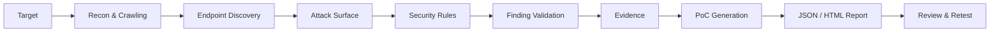

# ⚔️ SUDARSHAN v3.1

### Dynamic Application Security Testing Engine

<p align="center">
  <b>Scan. Detect. Validate. Prove. Report.</b>
</p>

<p align="center">
  
  
  
  
</p>

---

## Overview

**SUDARSHAN** is a Python-based **Dynamic Application Security Testing (DAST)** engine for automated web application security assessment.

It combines crawling, vulnerability detection, validation, evidence collection, PoC generation, and structured reporting into a single workflow.

### Key Features

* 22 vulnerability detection classes
* Web crawling and attack-surface discovery
* Concurrent security testing
* Finding validation
* Evidence collection
* Automated PoC generation
* JSON + HTML reports
* CLI-based scanning
* `pytest` test suite
* GitHub Actions CI/CD

---

## Workflow



### Pipeline

```text
Discover → Detect → Validate → Prove → Report → Retest
```

---

## Architecture

```text
                    SUDARSHAN
                        │
          ┌─────────────┴─────────────┐
          │                           │
       Crawler                    Rule Engine
          │                           │
          └─────────────┬─────────────┘
                        ▼
                  Finding Engine
                        │
                  ┌─────┴─────┐
                  ▼           ▼
              Validation   Evidence
                  │           │
                  └─────┬─────┘
                        ▼
                   PoC Generator
                        │
                 ┌──────┴──────┐
                 ▼             ▼
               JSON           HTML
              Report         Report
```

---

## Requirements

* Python **3.8+**
* pip
* Git

Check your environment:

```bash
python3 --version
pip3 --version
git --version
```

---

## Installation

```bash
git clone https://github.com/CalculusGuy/SUDARSHAN.git
cd SUDARSHAN/DAST_Engine

python3 -m venv venv
source venv/bin/activate

pip install -r requirements.txt
```

Verify:

```bash
python main.py --help
```

---

## Quick Start

### Basic Scan

```bash
python main.py --target https://example.com
```

### Full Scan

```bash
python main.py \
    --target http://localhost:3000 \
    --threads 20 \
    --max-pages 50 \
    --report both \
    --poc
```

Output:

```text
reports/
├── report.json
└── report.html

pocs/
├── poc_DAST-001.py
└── ...
```

---

## CLI

| Option         | Description               |
| -------------- | ------------------------- |
| `--target`     | Target URL                |
| `--threads`    | Concurrent workers        |
| `--max-pages`  | Maximum pages to crawl    |
| `--report`     | `json`, `html`, or `both` |
| `--report-dir` | Report directory          |
| `--poc`        | Generate PoCs             |
| `--poc-dir`    | PoC directory             |
| `--insecure`   | Disable TLS verification  |
| `--timeout`    | Request timeout           |

Example:

```bash
python main.py \
    --target http://localhost:3000 \
    --threads 20 \
    --report both \
    --poc
```

---

## Vulnerability Coverage

SUDARSHAN currently includes **22 detection classes**:

```text
SQL Injection
Cross-Site Scripting (XSS)
SSRF
Path Traversal
Command Injection
XXE
CSRF
JWT Weakness
Open Redirect
IDOR
LDAP Injection
XPath Injection
Host Header Injection
NoSQL Injection
Unrestricted File Upload
SSTI
HTTP Request Smuggling
CORS Misconfiguration
Race Condition
GraphQL Injection
Log4Shell
Sensitive Data Exposure
```

---

## Reports & PoCs

### JSON

Machine-readable output for automation and CI/CD.

### HTML

Human-readable security assessment report.

### PoCs

Generated scripts can be used to reproduce and validate detected findings.

```text
Finding
   ↓
Evidence
   ↓
Generated PoC
   ↓
Manual Validation
```

---

## Testing

Run the test suite:

```bash
pytest
```

Verbose:

```bash
pytest -v
```

---

## Project Structure

```text
SUDARSHAN/
├── main.py
├── app.py
├── crawler/
├── engine/
├── rules/
├── reporter/
├── tests/
├── reports/
├── pocs/
├── requirements.txt
└── README.md
```

---

## Roadmap

* [x] Core DAST engine
* [x] 22 vulnerability classes
* [x] Concurrent scanning
* [x] Finding validation
* [x] PoC generation
* [x] JSON / HTML reporting
* [x] Automated testing
* [x] CI/CD
* [ ] Authentication-aware scanning
* [ ] API security testing
* [ ] Finding deduplication
* [ ] Evidence replay
* [ ] SARIF output
* [ ] Security gates

---

## Responsible Use

**Only scan systems you own or have explicit authorization to test.**

Do not use SUDARSHAN for unauthorized scanning, destructive testing, unauthorized data access, or disruption of production systems.

---

## Author

### Nilanjan Chowdhury

**Cybersecurity Researcher & Security Tool Builder**

* GitHub: https://github.com/CalculusGuy
* Project: https://github.com/CalculusGuy/SUDARSHAN
* Live Demo: https://sudarshan-api-z66i.onrender.com/
* Portfolio: https://calculusguy.github.io/nilanjanchowdhury.github.io/

---

## License

Released under the **MIT License**.

---

<p align="center">
  <b>⚔️ SUDARSHAN</b><br>
  Automated Web Security. Engineered for Scale.
</p>
